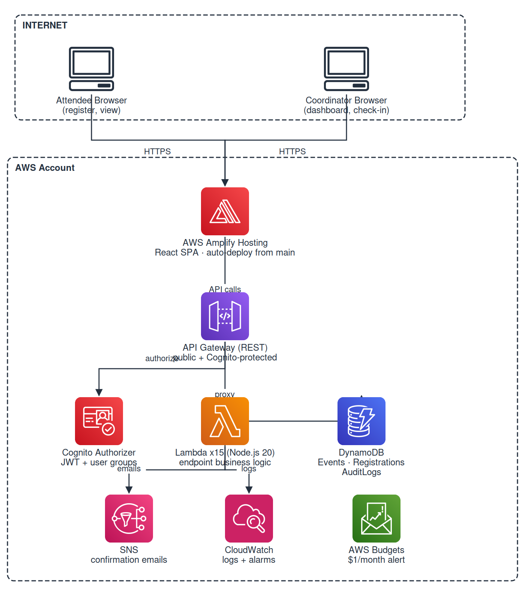

# Event Registration & Ticketing System

A fully serverless AWS-native event registration and ticketing system that replaces a manual Microsoft Forms + Excel workflow. The system has two distinct user-facing surfaces:

- **Public registration portal**: attendees self-register for events
- **Coordinator console**: staff manage events, check in attendees, print badges, and run reports

---

## High-Level Architecture



CI/CD: push `backend/**/*.mjs` → GitHub Actions runs Jest tests and updates all 15 Lambda functions; the frontend auto-deploys through Amplify on every push to `main`.

---

## Layer-by-Layer Technical Breakdown

### 1. Frontend: React/TanStack Start on Amplify

The frontend is a Single Page Application built with TanStack Start (React 19 + Vite). It is deployed as static files to AWS Amplify Hosting.

**How auth works on the frontend:**
- `src/lib/auth/cognito-client.ts` uses the `amazon-cognito-identity-js` SDK
- On sign-in, Cognito returns 3 tokens: **ID token**, **Access token**, **Refresh token**
- The ID token is a JWT stored in `localStorage` via the Cognito SDK
- Every API call attaches it as `Authorization: Bearer <idToken>`
- The JWT payload contains `cognito:groups` - the frontend reads this to determine role (`Admin`, `RegistrationOfficer`, `CheckinOfficer`) and shows/hides nav items accordingly
- `src/lib/hooks/use-auth.ts` exposes `isAdmin`, `isRegOfficer`, `isCheckinOfficer` booleans derived from the token groups

**How data flows:**
- `src/lib/api-client.ts` is the single source of truth for all HTTP calls
- It reads `VITE_API_URL` from env vars to know the API Gateway base URL
- TanStack Query caches responses, handles loading/error states, and auto-refetches

**Amplify Hosting:**
- Connected to the GitHub repo `TerryBinful/event-with-me`
- On every push to `main`, Amplify pulls the code, runs `bun run build`, and serves the `dist/` folder
- Environment variables (`VITE_API_URL`, `VITE_COGNITO_USER_POOL_ID`, etc.) are injected at build time via the Amplify console

---

### 2. Authentication: AWS Cognito

Cognito is the identity layer for all coordinator staff. Attendees do not need accounts.

**User Pool structure:**
```
Cognito User Pool: event-with-me-prod
  │
  ├── Users (staff accounts — email + password)
  │
  └── Groups
        ├── Admin               → full system access
        ├── RegistrationOfficer → walk-in + participants
        └── CheckinOfficer      → check-in only
```

**Token flow:**
```
Browser                    Cognito
  │                           │
  │── signIn(email, pass) ───▶│
  │◀── { idToken, accessToken, refreshToken } ──│
  │                           │
  │── API call + Bearer idToken ──▶ API Gateway
                                        │
                                   Cognito Authorizer
                                   validates token signature
                                   extracts sub, email, groups
                                        │
                                   Lambda receives
                                   event.requestContext
                                   .authorizer.claims
```

**Role enforcement:**
- API Gateway's Cognito Authorizer rejects any request with an invalid or expired token before it reaches Lambda
- Inside Lambda, `shared/auth.mjs` reads `claims["cognito:groups"]` and checks `isAdmin()` for admin-only operations
- The frontend also enforces roles visually (hides nav items, redirects) but the real enforcement is in Lambda

---

### 3. API Gateway

A REST API (not HTTP API) is used because it supports the Cognito Authorizer natively.

**Key design decisions:**
- `GET /events` and `POST /events/{eventId}/register` have `Auth: NONE` - public endpoints for attendees
- All other endpoints require a valid Cognito JWT
- CORS is configured at the API level to allow `*` origin (tighten to the Amplify domain in production)
- Each endpoint maps 1:1 to a Lambda function. NOshared handler routing

---

### 4. Lambda Functions

11 functions, all Node.js 20 ESM modules. Each function is small and single-purpose.

**Shared modules (`backend/shared/`):**

| Module | Purpose |
|---|---|
| `db.mjs` | DynamoDB DocumentClient singleton + table name env vars |
| `response.mjs` | Standard HTTP response helpers (`ok`, `created`, `badRequest`, etc.) with CORS headers |
| `ids.mjs` | UUID generator + registration number formatter (`SUMMIT-0001`) |
| `auth.mjs` | Extract caller identity from Cognito claims, `isAdmin()` check, audit log writer |

**Request lifecycle inside a Lambda:**
```
API Gateway event
      │
      ▼
1. OPTIONS check → return CORS headers immediately
2. Extract caller from event.requestContext.authorizer.claims
3. Parse + validate request body / path parameters
4. DynamoDB operation (Get, Put, Update, Delete, Query, Scan)
5. Write audit log entry (fire-and-forget)
6. Return standardised JSON response
```

**IAM permissions** - each Lambda has the minimum required DynamoDB policy:
- Read-only Lambdas → `DynamoDBReadPolicy`
- Write Lambdas → `DynamoDBCrudPolicy`
- Only `registerParticipant` has `SNSPublishMessagePolicy`

---

### 5. DynamoDB

Three tables, all using PAY_PER_REQUEST billing (free tier friendly. NOcapacity planning needed).

**Events table: tbl_events**
```
PK: eventId (string)
Attributes: name, date, venue, description, registrationOpen,
            primaryColor, accentColor, logoUrl, showQr,
            showRegistrationNumber, badgeFontSize,
            createdAt, updatedAt
```

**Registrations table: tbl_registration**
```
PK: registrationId (string)
This table use global indices

GSI 1: email-eventId-index
  PK: email, SK: eventId
  → Used for duplicate email check on registration
  → Used for GET /registrations/{email}

GSI 2: eventId-createdAt-index
  PK: eventId, SK: createdAt
  → Used for GET /events/{eventId}/registrations
  → Returns registrations sorted newest-first

Attributes: registrationNumber, fullName, organisation, email,
            phone, position, registrationType (online|walk_in),
            checkedInAt, checkedInBy, badgePrintedAt,
            badgePrintCount, createdBy, createdAt, updatedAt
```

**AuditLogs table: tbl_auditLogs**
```
PK: id (string)
Attributes: action, entity, entityId, actorId, actorLabel,
            meta (JSON), createdAt
```

---

### 6. SNS: Confirmation Emails

When `registerParticipant` runs successfully, it publishes a JSON message to the SNS topic `event-confirmations-prod` containing the attendee's name, email, registration number, event name, date and venue.

> The topic exists but has no subscriber yet, a confirmation email Lambda needs to be built and subscribed (see Step 5 in the setup checklist below).

---

---

### 8. AWS Budgets

A `$10/month` budget is defined. When actual spend exceeds 80% ($0.80), it publishes to the SNS confirmation topic. This keeps the system within the AWS free tier and alerts before any meaningful cost is incurred.

---

### 9. CI/CD Pipeline: GitHub Actions

```
Push to dvlp/main (backend/**/*.mjs)
        │
        ▼
Job 1: test
  - Checkout code
  - Node 20 setup
  - npm ci (backend/package.json)
  - Jest unit tests (backend/__tests__/)
        │
        ▼ (only if tests pass)
Job 2: deploy
  - Configure AWS credentials (from GitHub Secrets)
  - For each Lambda function, zip its code + shared/ subdirectory
  - Run lambda update-function-code for all 15 functions
  - Output result to GitHub Actions summary
```

Frontend deployment is handled entirely by Amplify, it watches the GitHub repo independently and deploys on every push to `main`.

---

## First-Time Setup

### Step 1: AWS Account & IAM

Create a dedicated IAM user for GitHub Actions deployments:

```
AWS Console → IAM → Users → Create user
  Name: github-actions-deployer
  Access type: Programmatic access
  Permissions: AdministratorAccess
  → Save Access Key ID + Secret Access Key
```

Add to GitHub repo **Settings → Secrets → Actions**:
```
AWS_ACCESS_KEY_ID     = <from IAM>
AWS_SECRET_ACCESS_KEY = <from IAM>
AWS_REGION            = us-east-1
```

---

---

### Step 2: Create the First Admin User

```bash
aws cognito-idp admin-create-user \
  --user-pool-id <UserPoolId> \
  --username admin@yourorg.com \
  --temporary-password Admin@1234 \
  --user-attributes Name=name,Value="Admin User"

aws cognito-idp admin-add-user-to-group \
  --user-pool-id <UserPoolId> \
  --username admin@yourorg.com \
  --group-name Admin
```

The admin signs in at `/auth` and is prompted by Cognito to set a permanent password on first login.

---

### Step 3: Connect AWS Amplify Hosting

```
AWS Console → Amplify → New app → Host web app
  → GitHub → TerryBinful/event-with-me → branch: main
  → Amplify detects amplify.yml automatically
  → App settings → Environment variables → Add:
      VITE_API_URL              = <API Gateway invoke URL>
      VITE_COGNITO_USER_POOL_ID = <Cognito UserPool ID>
      VITE_COGNITO_CLIENT_ID    = <Cognito App Client ID>
      VITE_AWS_REGION           = us-east-1
  → Save and deploy
```

Get these values from the AWS Console:
- **API Gateway invoke URL** → API Gateway → `EventsApi` → Stages → Invoke URL
- **Cognito UserPool ID** → Cognito → User pools → `userPool` → Pool ID
- **Cognito App Client ID** → Cognito → User pools → `userPool` → App integration → App client list → `EventRegistrationUserPool` → Client ID

---

### Step 4: Activate Confirmation Emails (SQS, SES)

**5a. Verify a sender email in SES:**
```
AWS Console → SES → Verified identities → Create identity
  → Email address: noreply@yourorg.com
  → Click the verification link sent to your inbox
```

**5b. Create a confirmation email Lambda** (`backend/notifications/sendConfirmationEmail.mjs`):
- Triggered by SNS topic `event-confirmations-prod`
- Parses the JSON message payload
- Calls `SESClient.sendEmail()` with a formatted HTML body

---

---

### Step 6: Tighten IAM Permissions

Replace `AdministratorAccess` on the GitHub Actions IAM user with a scoped policy covering only Lambda, API Gateway, DynamoDB, Cognito, SNS, IAM, and Budgets.

---

### Step 7: Custom Domain

```
AWS Console → Amplify → your app → Domain management
  → Add domain: events.yourorg.com
  → Amplify provisions SSL via ACM automatically
  → Update CORS AllowOrigin in API Gateway settings to your domain
```

---

## Cognito Groups (Roles)

| Group | Access |
|---|---|
| `Admin` | Full access — events, staff, reports, settings, audit |
| `RegistrationOfficer` | Walk-in registration, participants |
| `CheckinOfficer` | Check-in, walk-in (limited) |

---

---

## Badge Printing

Badge is **100mm × 60mm landscape**. In Chrome print dialog:
1. Paper size: 100mm × 60mm landscape
2. Margins: None
3. Uncheck "Headers and footers"

---

## Project Structure

```
backend/                  Lambda function code
  events/                 Lambda: createEvent, listEvents, updateEvent
  registrations/          Lambda: register, list, checkIn, walkIn,
                                  delete, update, print, audit
  shared/                 db.mjs, response.mjs, ids.mjs, auth.mjs
  __tests__/              Jest unit tests

src/
  lib/
    api-client.ts         All API calls to API Gateway
    auth/
      cognito-client.ts   Cognito sign-in/out/session/reset
    hooks/
      use-auth.ts         Cognito session + role hooks
  routes/                 TanStack file-based routes
  components/             UI components

.github/workflows/
  deploy-lambda-code.yml  CI/CD: test → zip → lambda update-function-code

amplify.yml               Amplify Hosting build config
.env.example              Required environment variables
```

---

## Setup Checklist

```
Infrastructure
  ☐ Create IAM user for GitHub Actions
  ☐ Add AWS_ACCESS_KEY_ID, AWS_SECRET_ACCESS_KEY, AWS_REGION to GitHub Secrets

Auth
  ☐ Create first admin user
  ☐ Test sign-in at /auth

Frontend
  ☐ Connect Amplify Hosting to GitHub repo
  ☐ Add environment variables in Amplify console
  ☐ Verify frontend loads and calls the API

Emails (optional)
  ☐ Verify sender email in SES
  ☐ Build sendConfirmationEmail Lambda
  ☐ Subscribe Lambda to SNS topic

Monitoring
  ☐ Wire CloudWatch alarms to SNS email notifications

Security
  ☐ Scope down IAM policy for GitHub Actions user
  ☐ Restrict CORS AllowOrigin to Amplify domain

Custom domain (optional)
  ☐ Configure custom domain in Amplify
  ☐ Update CORS in API Gateway settings
```
