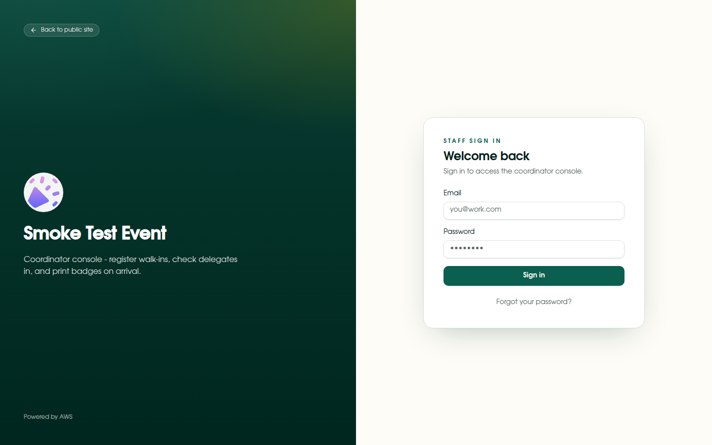
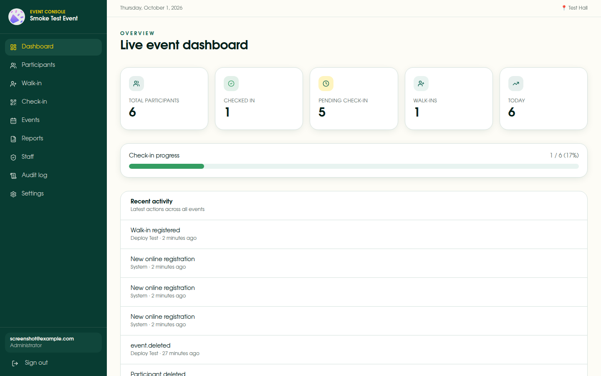
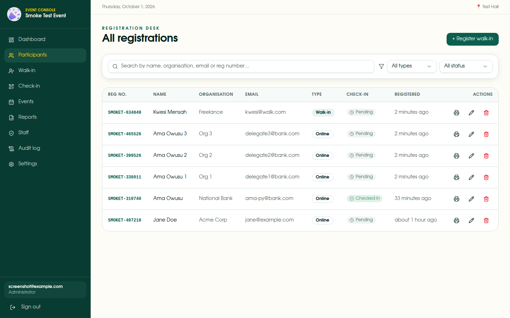
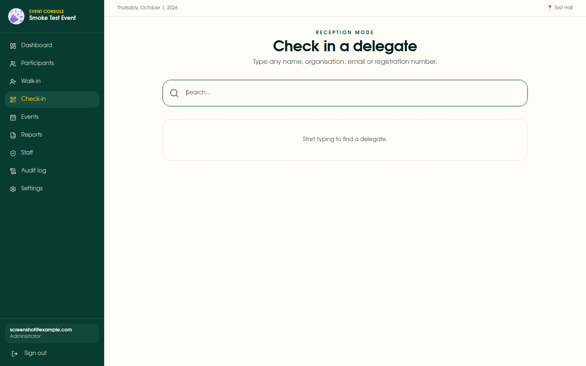
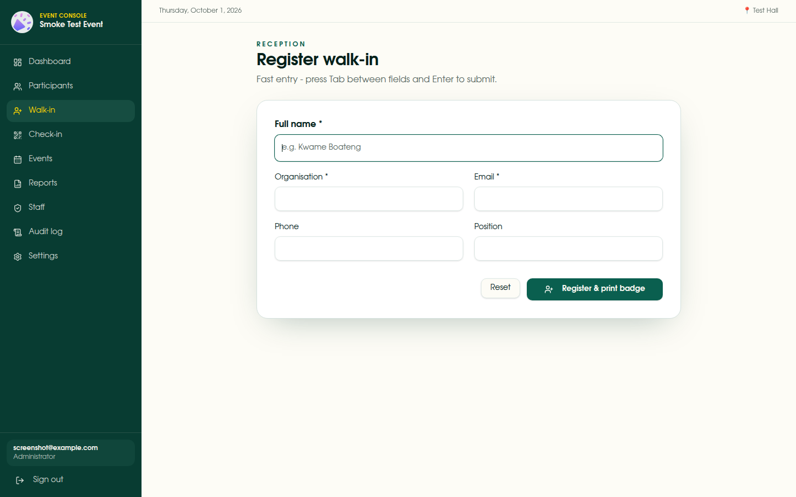
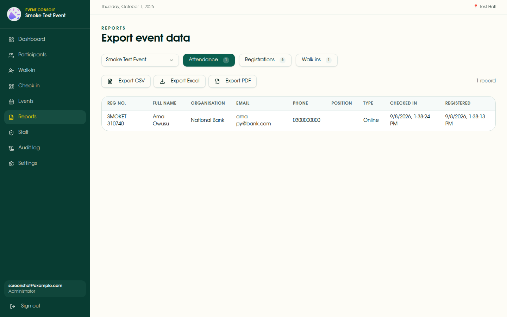

# Event Registration & Ticketing System

A serverless AWS event registration and ticketing system that replaces a manual Microsoft Forms + Excel workflow. Two user-facing surfaces:

- **Public registration portal** (`/register/...`): attendees self-register for events, no account needed
- **Coordinator console** (`/auth` + `_authenticated` routes): staff manage events, check attendees in, print badges, and run reports

**Status at a glance**

| Area                | State                                                                           |
| ------------------- | ------------------------------------------------------------------------------- |
| Backend API         | Live: 15 Python 3.13 Lambdas behind API Gateway (us-east-1)                     |
| Frontend            | Working, run via local `bun run dev`; Amplify Hosting not connected yet         |
| Confirmation emails | **Not wired**: SNS topic exists with no subscriber (see "Email pipeline" below) |
| Staff management    | Console page is a stub; in-app staff management is a planned workstream         |
| CI (GitHub Actions) | Backend workflow defined; repo still needs AWS credentials secrets              |

---

## Architecture


Four CloudFormation stacks, deployed in dependency order (each imports the previous stacks' exports):

| Stack                   | Contents                                                |
| ----------------------- | ------------------------------------------------------- |
| `event-with-me-auth`    | Cognito user pool, app client, three groups             |
| `event-with-me-data`    | 3 DynamoDB tables + SNS confirmation topic              |
| `event-with-me-lambdas` | 15 Lambda functions + shared execution role             |
| `event-with-me-api`     | REST API Gateway with Cognito authorizer + stage `prod` |

Templates are **generated**, not hand-written: `infra/generate-template.mjs` emits `infra/*.yaml`. Edit the generator, never the YAML.

---

## Frontend

TanStack Start (React 19 + Vite + TypeScript), styled with Tailwind + shadcn/ui.

```bash
bun install
cp .env.example .env   # fill in the four VITE_ values from your stacks
bun run dev            # http://localhost:5173
```

Scripts: `bun run build`, `bun run lint`, `bun run format`. Type-check with `npx tsc --noEmit`.

**Auth flow:** `src/lib/auth/cognito-client.ts` signs in over Cognito SRP (`amazon-cognito-identity-js`). The ID token goes out as `Authorization: Bearer <idToken>` on every call. `src/lib/hooks/use-auth.ts` derives `isAdmin` / `isRegOfficer` / `isCheckinOfficer` from the token's `cognito:groups` and drives navigation visibility (the API enforces the real rules).

**Data access:** all HTTP lives in `src/lib/api-client.ts`, which reads `VITE_API_URL`; TanStack Query handles caching and refetch.

**Amplify Hosting: not connected yet.** No Amplify app exists for this repo; the screenshots below were captured against `bun run dev`. `amplify.yml` is ready (build with bun, serve `dist/`, SPA rewrites) and Step 3 below connects it.

### Screenshots

Captured by `scripts/capture-screenshots.mjs` (puppeteer) against the live API. In [docs/screenshots](docs/screenshots):

| Login                                   | Dashboard                                       | Participants                                          | Check-in                                    | Walk-in                                    | Reports                                     |
| --------------------------------------- | ----------------------------------------------- | ----------------------------------------------------- | ------------------------------------------- | ------------------------------------------ | ------------------------------------------- |
|  |  |  |  |  |  |

Plus `02-login-filled`, `04-events`, `09-audit`, `10-settings`, `11-staff` (currently the Cognito-instructions stub), `12-register-public`.

---

## Backend

### API endpoints (API Gateway REST, stage `prod`)

| Method + path                         | Auth    | Lambda                |
| ------------------------------------- | ------- | --------------------- |
| `GET /events`                         | none    | `ListEvents`          |
| `POST /events`                        | Admin\* | `CreateEvent`         |
| `GET /events/{eventId}`               | JWT     | `GetEvent`            |
| `PUT /events/{eventId}`               | Admin\* | `UpdateEvent`         |
| `DELETE /events/{eventId}`            | Admin\* | `DeleteEvent`         |
| `POST /events/{eventId}/register`     | none    | `RegisterParticipant` |
| `GET /events/{eventId}/registrations` | JWT     | `ListRegistrations`   |
| `POST /events/{eventId}/walk-in`      | JWT     | `WalkInRegistration`  |
| `GET /registrations/by-email/{email}` | JWT     | `GetRegistrations`    |
| `GET /registrations/{id}`             | JWT     | `GetRegistration`     |
| `PUT /registrations/{id}`             | JWT     | `UpdateRegistration`  |
| `DELETE /registrations/{id}`          | JWT     | `DeleteRegistration`  |
| `POST /registrations/{id}/checkin`    | JWT     | `CheckIn`             |
| `POST /registrations/{id}/print`      | JWT     | `PrintBadge`          |
| `GET /audit`                          | Admin\* | `GetAuditLog`         |

\* Requires a Cognito JWT; `*` marks handlers that additionally enforce `isAdmin()` (or officer roles) in code. `OPTIONS` on every path returns CORS headers from the Lambda. CORS origin comes from the `ALLOWED_ORIGIN` env var, set via the lambdas stack's `AllowedOrigin` parameter (default `*`; repoint with `scripts/update-cors-origin.sh`).

### Lambda functions

15 functions, Python 3.13, defined in `FUNCS` in `infra/generate-template.mjs`. Each zip ships its handler plus the `shared/` package (`backend/shared/`: `db.py` boto3 clients, `response.py` CORS+JSON helpers, `ids.py` UUID + registration number formatter, `auth.py` claims extraction, `isAdmin`, audit writer). All functions share one role: CloudWatch Logs + DynamoDB access on the three tables + publish on the confirmation topic.

`backend/registrations/ticketProcessing.py` is **not deployed**; it holds the email template the future confirmation-email Lambda builds on.

### Data model (DynamoDB, PAY_PER_REQUEST)

- **event-with-me-events** - PK `eventId`; name, date, venue, description, registrationOpen, badge styling fields, timestamps
- **event-with-me-registrations** - PK `registrationId`; GSI `email-eventId-index` (duplicate-email check, by-email lookup) and GSI `eventId-createdAt-index` (roster newest-first); registrationNumber, attendee details, `registrationType` (online|walk_in), check-in and badge-print tracking
- **event-with-me-audit-logs** - PK `id`; action, entity, entityId, actorId/Label, meta, createdAt

### Email pipeline (not built yet)

The SNS topic `event-with-me-confirmations` exists (data stack) but has **no subscriber**. `registerParticipant` only sends to SQS when `REGISTRATION_QUEUE_URL` is set, which it isn't, so no message is currently produced. Planned: a SES-backed confirmation Lambda consuming the topic (template available in `ticketProcessing.py`).

---

## Deploying & operating

### First deploy of the backend

```bash
scripts/deploy-stack.sh            # base name default: event-with-me
```

The script zips each handler with `shared/` under `shared/`, uploads to `s3://event-with-me-deploy-<account>/event-with-me/<name>-<md5-12>.zip`, regenerates the stack YAMLs with content-hashed S3 keys, then creates/updates the four stacks in order and redeploys the API stage. The content hash matters: CloudFormation only sees a code change when the **S3 key changes**.

After the first deploy, read the values you need from stack outputs (`aws cloudformation describe-stacks --stack-name event-with-me-api` etc.): the invoke URL, pool ID, and app client ID go into `.env` (local) and later the Amplify console.

### CI: GitHub Actions

`.github/workflows/deploy-lambda-code.yml` triggers on pushes to `main`/`dvlp` touching `backend/**/*.py` (plus manual dispatch): a `test` job (Python 3.13, pip, pytest) gates a `deploy` matrix that zips each function and runs `lambda update-function-code`.

It is **not functional yet**: the repo has no `AWS_ACCESS_KEY_ID` / `AWS_SECRET_ACCESS_KEY` / `AWS_REGION` secrets, so the deploy jobs fail at credential load. The local `scripts/deploy-stack.sh` path is what has been used so far.

### First-time setup checklist

1. **AWS credentials for you (the operator):** configure the AWS CLI profile that will run `scripts/deploy-stack.sh`.
2. **Deploy backend:** `scripts/deploy-stack.sh`, then verify with a smoke call: `curl https://<api-id>.execute-api.us-east-1.amazonaws.com/prod/events` returns `[]`.
3. **Create the first Admin:**

   ```bash
   aws cognito-idp admin-create-user \
     --user-pool-id <UserPoolId> \
     --username admin@yourorg.com \
     --temporary-password 'Admin@1234' \
     --user-attributes Name=name,Value="Admin User"
   aws cognito-idp admin-add-user-to-group \
     --user-pool-id <UserPoolId> --username admin@yourorg.com --group-name Admin
   ```

   First sign-in at `/auth` prompts for a permanent password.

4. **Local frontend:** `.env` with the four `VITE_` values, `bun run dev`, sign in at `/auth`.
5. **Connect Amplify Hosting (optional):** Amplify console → host `main` branch; `amplify.yml` is detected automatically; add the four `VITE_` vars in Amplify environment settings. Then set `AllowedOrigin` to the Amplify domain via `scripts/update-cors-origin.sh`.
6. **GitHub Actions secrets (optional, before using CI):** create a scoped IAM user (Lambda, API Gateway, DynamoDB, Cognito, SNS, S3 artifact bucket, `iam:PassRole` for the Lambda role), add `AWS_ACCESS_KEY_ID`, `AWS_SECRET_ACCESS_KEY`, `AWS_REGION` as repo secrets.
7. **Email pipeline (optional):** verify a sender identity in SES, build the SNS-triggered confirmation Lambda from `ticketProcessing.py`, subscribe it to `event-with-me-confirmations`.

---

## Cognito roles

| Group                 | Access                                                |
| --------------------- | ----------------------------------------------------- |
| `Admin`               | Full access - events, staff, reports, settings, audit |
| `RegistrationOfficer` | Walk-in registration, participants                    |
| `CheckinOfficer`      | Check-in, walk-in (limited)                           |

Enforcement lives in the handlers (`shared/auth.py`); the API Gateway Cognito authorizer rejects invalid/expired tokens first.

---

## Testing

```bash
backend/.venv/bin/python -m pytest tests -q   # or: python -m pytest backend/tests
```

11 pytest tests (`backend/tests/`) with faked DynamoDB tables via `conftest.py` helpers. Frontend gates: `bun run lint`, `npx tsc --noEmit`, `bun run build`.

Screenshot suite (optional, needs `bun install` for the puppeteer devDependency and a running dev server):

```bash
bun run dev &
bun scripts/capture-screenshots.mjs   # writes docs/screenshots/*.png
```

---

## Badge printing

Badge is **100 mm × 60 mm landscape**. In Chrome's print dialog: paper 100×60 mm landscape, margins none, headers/footers off.

---

## Project structure

```
backend/
  events/            5 event handlers (.py)
  registrations/     10 registration handlers (.py) + ticketProcessing.py (undeployed)
  shared/            db.py, response.py, ids.py, auth.py
  tests/             pytest suite
  requirements-dev.txt

infra/
  generate-template.mjs   source of truth for the 4 CFN stacks
scripts/
  deploy-stack.sh         zip + hash + upload + stack deploy
  update-cors-origin.sh   repoint AllowedOrigin
  capture-screenshots.mjs puppeteer screenshot capture

src/
  lib/               api-client.ts, auth/cognito-client.ts, hooks/use-auth.ts, ...
  routes/            TanStack file-based routes (see src/routes/README.md)
  components/        UI components

docs/
  screenshots/       12 UI screenshots
  architecture.png   diagram export (editable .drawio kept untracked locally)

.github/workflows/
  deploy-lambda-code.yml  CI: pytest → zip → update-function-code (needs secrets)

amplify.yml               ready for Amplify Hosting (not connected yet)
.env.example              the four VITE_ values to copy into .env
```
